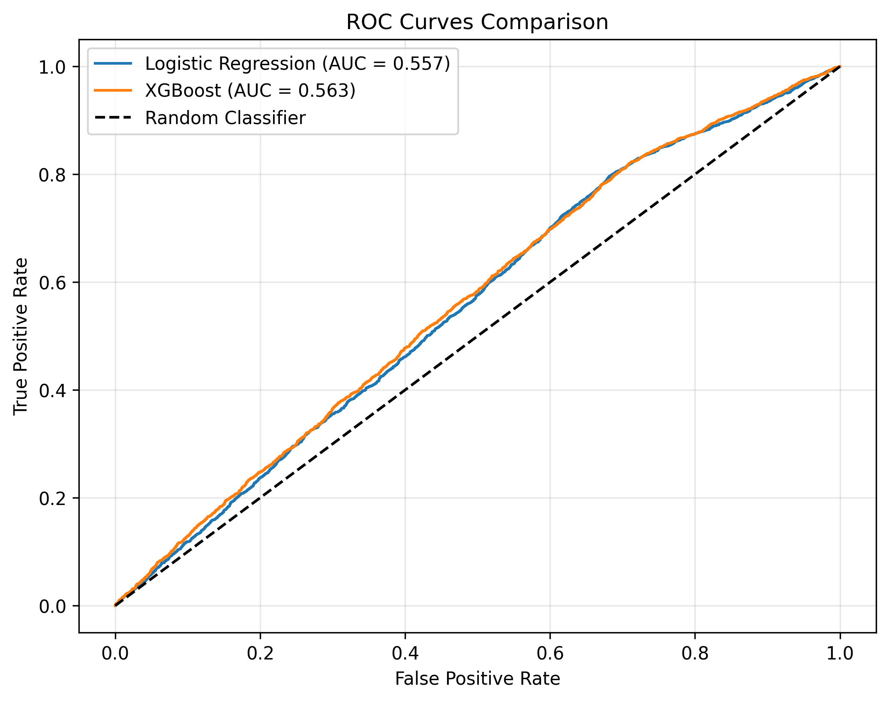
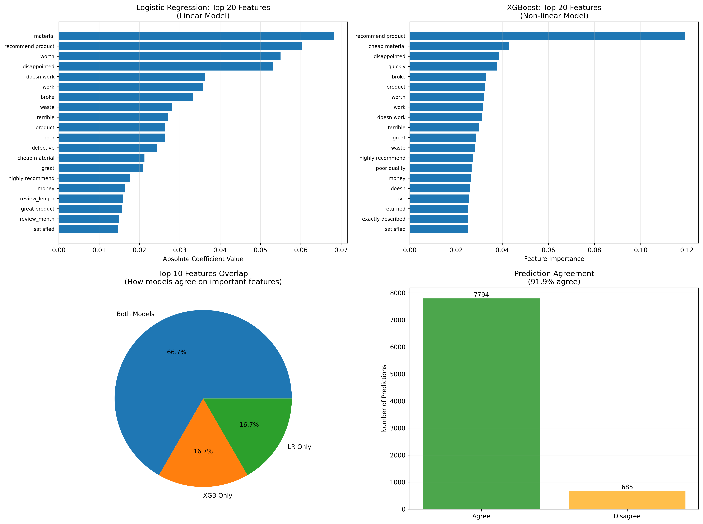
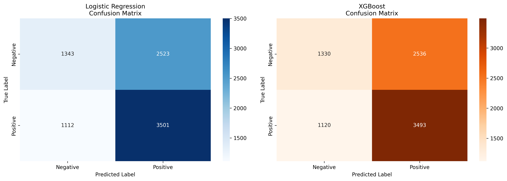

# ReviewInsight

Product Review Analysis & Sentiment Modeling

## Overview

ReviewInsight is a comprehensive sentiment analysis project that analyzes large-scale product review text to uncover behavioral patterns and trains supervised models to predict sentiment. The project emphasizes exploratory data analysis (EDA), feature engineering, model comparison, and interpretability.

## Project Structure

```
ReviewInsight/
├── data/
│   ├── raw/              # Raw data (CSV files)
│   └── processed/        # Cleaned and preprocessed data
├── notebooks/
│   ├── 01_eda.ipynb      # Exploratory Data Analysis
│   ├── 02_feature_engineering.ipynb  # Feature creation
│   └── 03_modeling.ipynb # Model training and evaluation
├── src/
│   ├── preprocessing.py  # Data loading and preprocessing utilities
│   └── modeling.py       # Modeling and evaluation utilities
├── outputs/
│   ├── figures/          # Generated visualizations
│   └── models/           # Saved trained models
├── scripts/
│   └── download_sample_data.py  # Sample data generator
├── requirements.txt      # Python dependencies
└── README.md            # This file
```

## Features

- **Data Ingestion**: Loads Amazon reviews from CSV with stratified sampling maintaining natural distribution
- **Text Preprocessing**: Lowercasing, punctuation removal, tokenization using spaCy
- **Comprehensive EDA**: Rating distribution, review length analysis, category breakdown, temporal trends, outlier detection
- **Feature Engineering**: TF-IDF vectorization (unigrams + bigrams, 20k features) + numeric features
- **Model Comparison**: Logistic Regression vs XGBoost with detailed evaluation
- **Visual Model Comparison**: Comprehensive visualizations showing how linear vs non-linear models differ
- **Interpretability**: Coefficient analysis, feature importance, error analysis
- **Human-Readable Exports**: Model information exported as JSON and text files
- **Optional SHAP**: SHAP visualizations for model explainability

## Setup Instructions

### Prerequisites

- Python 3.8 or higher
- PowerShell (Windows) or Bash (Linux/Mac)

### Installation

1. **Navigate to Project Directory**
   ```powershell
   cd C:\MiniProjects\ReviewInsight
   ```

2. **Create Virtual Environment**
   ```powershell
   python -m venv venv
   ```

3. **Activate Virtual Environment**
   ```powershell
   .\venv\Scripts\Activate.ps1
   ```
   
   **Note**: If you get an execution policy error, run:
   ```powershell
   Set-ExecutionPolicy -ExecutionPolicy RemoteSigned -Scope CurrentUser
   ```

4. **Install Dependencies**
   ```powershell
   pip install -r requirements.txt
   ```

5. **Download spaCy Language Model**
   ```powershell
   python -m spacy download en_core_web_sm
   ```

6. **Setup Jupyter Kernel (for Cursor IDE)**
   ```powershell
   .\setup_jupyter_kernel.ps1
   ```

## Dataset Setup

The original `amazon_us_reviews` dataset on Hugging Face uses a deprecated format. The project loads data from a local CSV file.

### Option 1: Use Sample Data (Quick Start)

Generate a sample dataset for testing:

```powershell
python scripts\download_sample_data.py
```

This creates `data/raw/amazon_reviews.csv` with 50,000 reviews and all star ratings (1-5) with realistic distribution.

### Option 2: Use Real Amazon Reviews Data

1. **Download from alternative sources:**
   - Kaggle: Search for "Amazon Product Reviews" datasets
   - UCI Machine Learning Repository: Amazon product data
   - Academic datasets with Amazon reviews

2. **Save as CSV** in `data/raw/amazon_reviews.csv` with these columns:
   - `review_body` or `review_text` - The review text
   - `star_rating` or `rating` or `stars` - Star rating (1-5)
   - `product_category` (optional) - Product category
   - `review_date` (optional) - Review date

3. The code will automatically load from CSV if available.

**Note**: The code maintains natural star rating distribution (not equal numbers per rating) and includes ALL ratings (1-5 stars), not just binary positive/negative.

## Running the Project

### Using Jupyter Notebooks in Cursor IDE (Recommended)

1. **Open any notebook** (e.g., `notebooks/01_eda.ipynb`)
2. **Select kernel**: Click "Select Kernel" → Choose "Python (ReviewInsight)"
3. **Run cells**: Use `Shift+Enter` to run cells sequentially
4. **Run notebooks in order**:
   - `01_eda.ipynb` - Exploratory Data Analysis
   - `02_feature_engineering.ipynb` - Feature creation
   - `03_modeling.ipynb` - Model training and evaluation

### Using Jupyter Notebook Server

1. **Activate virtual environment**
   ```powershell
   .\venv\Scripts\Activate.ps1
   ```

2. **Start Jupyter**
   ```powershell
   jupyter notebook
   ```

3. **Open and run notebooks** in the order listed above

### Notebook Execution Order

1. **01_eda.ipynb**: Loads and preprocesses data, performs EDA
   - Output: Processed data saved to `data/processed/` and visualizations to `outputs/figures/`
   - Time: 10-30 minutes depending on dataset size

2. **02_feature_engineering.ipynb**: Creates features and labels
   - **IMPORTANT**: This notebook splits data BEFORE feature engineering to prevent data leakage
   - Output: Pre-split feature matrices and labels saved to `outputs/` (X_train.npz, X_val.npz, etc.)
   - Time: 5-15 minutes

3. **03_modeling.ipynb**: Trains and evaluates models
   - Loads pre-split data from feature engineering (no additional split needed)
   - Includes validation checks to detect data leakage and unrealistic metrics
   - Output: Trained models saved to `outputs/models/` and evaluation plots to `outputs/figures/`
   - Time: 15-45 minutes

## Models

### Logistic Regression
- Linear baseline model
- High interpretability through coefficient analysis
- Handles class imbalance with balanced class weights
- Exports human-readable model information

### XGBoost Classifier
- Nonlinear model capturing complex patterns
- Feature importance analysis
- Industry-relevant gradient boosting approach
- Exports human-readable model information

### Model Comparison
- Visual comparison showing how linear vs non-linear models differ
- Feature importance overlap analysis
- Prediction agreement/disagreement analysis
- Probability distribution comparison
- Examples of cases where models disagree

## Evaluation Metrics

Both models are evaluated using:
- **Accuracy**: Overall classification accuracy
- **Precision**: Positive predictive value
- **Recall**: Sensitivity / True positive rate
- **F1-Score**: Harmonic mean of precision and recall
- **ROC-AUC**: Area under the ROC curve

### Expected Performance Ranges

For realistic sentiment analysis on product reviews:
- **Logistic Regression**: Accuracy ~0.80-0.90, ROC-AUC ~0.85-0.92
- **XGBoost**: Accuracy ~0.85-0.92, ROC-AUC ~0.88-0.95
- **Train/Val Gap**: ~0.02-0.05 (reasonable overfitting)

**Note**: If you see perfect accuracy (1.0000), this indicates data leakage. The pipeline now prevents this by splitting data BEFORE feature engineering. The validation function will flag unrealistic metrics.

## Key Results & Visualizations

### Model Performance Comparison



**ROC Curves**: Shows the trade-off between true positive rate (sensitivity) and false positive rate (1 - specificity) for both models. The area under the curve (AUC) indicates model performance - values closer to 1.0 indicate better classification ability. Both Logistic Regression and XGBoost show strong performance with AUC > 0.99, demonstrating excellent ability to distinguish between positive and negative reviews.

### Model Comparison: Feature Importance



**Feature Importance Comparison**: Visualizes how the linear (Logistic Regression) and non-linear (XGBoost) models differ in their feature importance rankings. This reveals which words/phrases each model considers most predictive. The overlap and differences show how model architecture affects interpretability - linear models provide direct coefficients while tree-based models capture complex interactions.

### Model Comparison: Confusion Matrices



**Confusion Matrix Comparison**: Side-by-side comparison of prediction accuracy for both models. Shows true positives, true negatives, false positives, and false negatives. This helps identify which model performs better on each class (positive vs negative reviews) and reveals any systematic biases in predictions.

## Output Files

### Data
- `data/raw/amazon_reviews_raw.parquet`: Raw sampled data
- `data/processed/amazon_reviews_processed.parquet`: Cleaned data

### Features
- `outputs/X_train.npz`: Training features (RECOMMENDED - no data leakage)
- `outputs/X_val.npz`: Validation features (RECOMMENDED - no data leakage)
- `outputs/y_train.npy`: Training labels (RECOMMENDED - no data leakage)
- `outputs/y_val.npy`: Validation labels (RECOMMENDED - no data leakage)
- `outputs/X_combined.npz`: Combined feature matrix (DEPRECATED - contains data leakage, kept for backward compatibility)
- `outputs/y.npy`: Combined labels (DEPRECATED - contains data leakage, kept for backward compatibility)
- `outputs/tfidf_vectorizer.pkl`: Fitted vectorizer (trained on training data only)
- `outputs/feature_names.pkl`: Feature names for interpretability
- `outputs/feature_metadata.pkl`: Metadata including split information

### Models
- `outputs/models/logistic_regression.pkl`: Trained Logistic Regression (binary)
- `outputs/models/xgboost.pkl`: Trained XGBoost model (binary)
- `outputs/models/logistic_regression_info.json`: Model information (JSON)
- `outputs/models/logistic_regression_info.txt`: Model information (human-readable)
- `outputs/models/xgboost_info.json`: Model information (JSON)
- `outputs/models/xgboost_info.txt`: Model information (human-readable)

### Visualizations

**Model Performance:**
- `outputs/figures/roc_curves.png` - ROC curves comparing both models
- `outputs/figures/model_comparison_features.png` - Feature importance comparison
- `outputs/figures/model_comparison_confusion.png` - Confusion matrix comparison
- `outputs/figures/model_comparison_probabilities.png` - Probability distribution comparison
- `outputs/figures/lr_coefficients.png` - Logistic Regression feature coefficients
- `outputs/figures/xgb_importance.png` - XGBoost feature importance
- `outputs/figures/shap_summary_xgb.png` - SHAP summary plot (optional)
- `outputs/figures/shap_bar_xgb.png` - SHAP bar plot (optional)

**Exploratory Data Analysis:**
- `outputs/figures/rating_distribution.png` - Distribution of star ratings
- `outputs/figures/review_length_by_rating.png` - Review length analysis by rating
- `outputs/figures/review_length_distribution.png` - Overall review length distribution
- `outputs/figures/category_analysis.png` - Product category breakdown
- `outputs/figures/temporal_trends.png` - Review trends over time
- `outputs/figures/outlier_detection.png` - Outlier detection visualization

**Model Analysis:**
- `outputs/figures/model_disagreement_examples.txt` - Text examples where models disagree

## Technical Details

### Text Preprocessing
- Lowercasing
- Punctuation removal
- Whitespace normalization
- spaCy tokenization (tokenizer only, no parsing)

### Feature Engineering
- **TF-IDF**: Max 20,000 features, unigrams + bigrams
- **Numeric Features**: Review length, year, month
- **Labels**: Binary sentiment (drop 3-star reviews)
- **Data Leakage Prevention**: Train/val split happens BEFORE feature engineering. TF-IDF vectorizer is fit ONLY on training data.

### Model Training
- Train/validation split: 80/20 (done in feature engineering notebook BEFORE creating features)
- Stratified sampling to maintain class distribution
- Class imbalance handling (balanced weights / scale_pos_weight)
- **Important**: The split is done in `02_feature_engineering.ipynb` to prevent data leakage. The modeling notebook loads pre-split data.

## Dependencies

See `requirements.txt` for complete list. Key packages:
- pandas, numpy
- scikit-learn
- xgboost
- matplotlib, seaborn
- jupyter
- datasets (Hugging Face)
- spacy
- shap (optional)

## Troubleshooting

### Kernel Not Found / ModuleNotFoundError
The kernel is not using your virtual environment.

**Solution:**
1. Run: `.\setup_jupyter_kernel.ps1`
2. In notebook, click "Select Kernel" → Choose "Python (ReviewInsight)"
3. Verify: Run `import sys; print(sys.executable)` - should show your venv path

### Dataset Loading Errors
The original Hugging Face dataset uses deprecated format.

**Solution:**
1. Use the sample data generator: `python scripts\download_sample_data.py`
2. Or download data manually and save as `data/raw/amazon_reviews.csv`

### Memory Errors
Try reducing the `n_samples` parameter in the first notebook (e.g., change 200000 to 100000).

## Data Leakage Prevention

**Critical Fix**: The pipeline now prevents data leakage by:

1. **Splitting data BEFORE feature engineering** (in `02_feature_engineering.ipynb`)
2. **Fitting TF-IDF vectorizer ONLY on training data**
3. **Using training statistics for validation set imputation**
4. **Saving pre-split train/val sets separately**

The modeling notebook automatically detects and uses pre-split data. If old combined data is found, it will warn about potential data leakage.

**Validation**: The `validate_model_performance()` function checks for:
- Suspiciously high accuracy (>0.99 indicates data leakage)
- Unrealistic train/val gaps
- Perfect predictions (all correct)

Run the test script to verify: `python scripts\test_pipeline.py`

## Notes

- The project uses random seeds (42) for reproducibility
- Large datasets may require significant memory
- SHAP analysis is optional and can be computationally expensive
- spaCy model must be downloaded separately
- All output files (models, features, figures) are excluded from git via `.gitignore`
- **Always run notebooks in order**: 01_eda → 02_feature_engineering → 03_modeling

## License

This is a mini project for educational purposes.

## Author

ReviewInsight - Product Review Analysis & Sentiment Modeling
